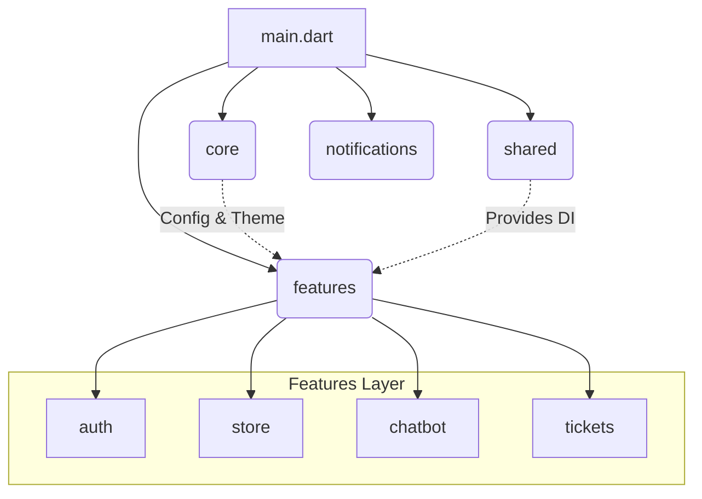
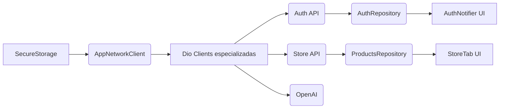

# 01 - Arquitectura tecnica

## 1. Resumen ejecutivo

La aplicacion `theoriginallab_v2` esta construida en Flutter, organizada por features y gestionada con Riverpod.
Su arquitectura combina:

- Estructura por capas (presentation, domain, data) en modulos clave.
- Inyeccion de dependencias centralizada en `lib/shared/providers/providers.dart`.
- Cliente HTTP basado en Dio con interceptores de autenticacion, retry, manejo de 401 y pinning de certificado para dominios propios.
- Integracion con Firebase Cloud Messaging para notificaciones push.
- Integracion con servicios externos (OpenAI, webhooks de Make.com, backend API propio, sitio ecommerce y webviews).

## 2. Stack Tecnológico Principal

| Categoría | Tecnología | Detalles / Paquetes Clave |
|---|---|---|
| **Framework UI** | Flutter & Dart | `sdk: ">=3.0.0 <4.0.0"` |
| **Estado Global** | Riverpod | `flutter_riverpod`, `riverpod_annotation` |
| **Networking** | Dio | `dio`, `pretty_dio_logger`, Custom Interceptors |
| **Persistencia Local** | Secure Storage & SharedPreferences | `flutter_secure_storage` (Tokens), `shared_preferences` |
| **Push Notifications** | Firebase Cloud Messaging (FCM) | `firebase_core`, `firebase_messaging`, `flutter_local_notifications` |
| **Modelado / JSON** | Freezed & JSON Serializable | `freezed`, `json_annotation` |
| **Servicios Externos** | Mapas, WebView, IA | `google_maps_flutter`, `webview_flutter`, OpenAI API |

## 3. Estructura de Alto Nivel (Clean Architecture)

> [!NOTE]
> La aplicación sigue el principio de separación de responsabilidades dividiendo el código en `core`, `shared` y `features`.



La estructura física refleja este modelo:

```text
lib/
  core/           # Configuraciones base, validadores, red, seguridad, tema
  shared/         # Proveedores globales de DI (`providers.dart`) y widgets UI reusables
  features/       # Módulos de negocio (Presentation, Domain, Data)
  notifications/  # Servicios en background (FCM)
  main.dart       # Punto de entrada
```

## 4. Capas y responsabilidades

### 4.1 Capa `core`

Contiene componentes transversales:

- `config/config_validator.dart`
  - Valida variables criticas al inicio.
  - En `release/profile` falla rapido si falta configuracion.

- `constants/api_constants.dart`
  - Centraliza base URLs, endpoints, headers y timeouts.

- `network/`
  - `network_client.dart`: fabrica de clientes Dio.
  - Interceptores:
    - `auth_interceptor.dart`: inyecta token.
    - `unauthorized_interceptor.dart`: captura 401 y dispara logout.
    - `retry_interceptor.dart`: reintentos configurables.
    - `certificate_pinning_interceptor.dart`: pinning TLS en release para backend propio.

- `security/device_security.dart`
  - Deteccion de root/jailbreak.
  - En release, si el dispositivo esta comprometido, la app se cierra.

- `theme/` y `validators/`
  - Sistema visual y validaciones reutilizables.

### 4.2 Capa `shared`

- Proveedores de DI global (`shared/providers/providers.dart`).
- Widgets reutilizables (estados, loaders, tarjetas, animaciones).
- Utilidades comunes.

### 4.3 Capa `features`

Cada feature contiene su propia logica funcional.
Patron dominante:

- `presentation/`: pantallas, widgets, providers/notifiers.
- `domain/`: entidades y contratos (repositorios).
- `data/`: repositorios concretos, datasources y modelos.

No todos los modulos siguen una limpieza 100% estricta, pero la direccion general es modular y mantenible.

## 5. Inicializacion de app (arranque)

Secuencia en `main.dart`:

1. `WidgetsFlutterBinding.ensureInitialized()`.
2. `ConfigValidator.validate()`.
3. Inicializacion de locale (`initializeDateFormatting('es')`).
4. Inicializacion Firebase.
5. Registro handler FCM en background.
6. Carga `SharedPreferences`.
7. Validacion de seguridad de dispositivo (release).
8. Creacion manual de `ProviderContainer` global.
9. Inicializacion anticipada de:
   - `FcmService.initialize(container)`
   - `InAppMessagingService.initialize()`
10. `runApp` con `UncontrolledProviderScope`.

Resultado: listeners de FCM viven desacoplados del ciclo de vida de widgets.

## 6. Inyección de Dependencias (DI)

> [!IMPORTANT]
> `lib/shared/providers/providers.dart` es el corazón de la composición de la app. Centraliza los conectores entre Presentation, Domain y Data, favoreciendo la inmutabilidad y las pruebas unitarias.



Ventaja arquitectónica central: Cada *feature* consume contratos abstractos (`Repository`) e interactúa a través de `Providers`, sin acoplarse directamente a las implementaciones concretas.

## 7. Arquitectura de Red

### 7.1 Política de Cliente HTTP
`AppNetworkClient.createClient(...)` actúa como la fábrica estándar para las peticiones y define:
- **Base URL y Headers** ajustados por dominio.
- **Timeouts** configurados por criticidad de servicio.
- **Interceptores** modulares.
- **Caché interno** de instancias Dio compartidas.

### 7.2 Manejo y Seguridad en Red
> [!IMPORTANT]
> El ciclo de vida de la red aplica políticas defensivas sobre la marcha.

- **Inyección de Token:** Se inyecta el `Auth header` automáticamente a los servicios internos.
- **Logout Reactivo:** Logout automático al interceptar un `401 Unauthorized`.
- **Resiliencia (Retry):** Reintentos configurables para errores transitorios (5xx o fallas aisladas).
- **Certificate Pinning:** Anclaje fijo de TLS activado **únicamente en `--release`** y sólo para dominios propios. No bloquea integraciones de terceros (ej. OpenAI).

### 7.3 Manejo de Errores
- `NetworkErrorMapper`: Traduce errores crudos de `DioException` a mensajes comprensibles para el usuario.
- **Capa Domain:** Los repositorios convierten las excepciones a `Failure`/`Either` para que la UI reaccione a estados de error predecibles.

---

## 8. Persistencia Local

La aplicación divide su almacenamiento interno por nivel de criticidad.

### 8.1 Datos Sensibles (`flutter_secure_storage`)
Almacenados y cifrados mediante el *Keystore* (Android) o *Keychain* (iOS):
- Access token (Bearer).
- Datos del perfil: `user_id`, email, nombre, teléfono.
- Metadatos de sesión cruzados: `login_at`, `expires_in` y bandera genérica de inicio de sesión.

> [!CAUTION]
> **Validación Segura de Sesión:** Antes de cualquier solicitud, se evalúa si la sesión es válida sumando `login_at` + `expires_in` (TTL). Si ha vencido localmente, se destruye la sesión sin gastar rendimiento contactando al servidor.

### 8.2 Datos No Sensibles (`shared_preferences`)
- Caché de notificaciones in-app (`app_notifications_v1`), limitada a los últimos 50 registros para evitar sobrecarga de memoria local.

---

## 9. Seguridad Transversal

> [!CAUTION]
> Esta aplicación opera bajo lineamientos estrictos para proteger las credenciales y asegurar que el ambiente de despliegue sea íntegro.

Controles de seguridad observables implementados:

- **Fail-fast de Configuración Crítica:** La app no inicializa si las variables del `.env` marcadas como requeridas faltan.
- **TLS Obligatorio:** Requerimiento de `https://` en variables de entorno validadas en el arranque (OWASP M5).
- **Certificate Pinning:** Anclaje TLS para backend propio activo de manera exclusiva en compilación `--release`.
- **Protección Root / Jailbreak:** `DeviceSecurity` evalúa el entorno. Si el dispositivo está comprometido en `release`, la app finaliza su proceso.
- **Timeout por Inactividad:** Lógica agregada en la UI mediante gestos para desconectar sesiones inactivas tras 15 minutos (OWASP M3).

---

## 10. Integraciones Externas

| Servicio / Destino | Propósito Funcional | Naturaleza |
|---|---|---|
| **API Auth / Principal** | `/api/login`, `/api/register`, Password Reset. | _Core Backend_ |
| **API Home / Content** | Servir catálogos dinámicos, banners y casos de éxito. | _Core Backend_ |
| **API Tickets** | Carga asíncrona de soporte y `base64` uploads. | _Core Backend_ |
| **API Products** | Consulta del catálogo de servicios B2B de la empresa. | _Core Backend_ |
| **OpenAI (Chat API)** | Motor inteligente del Agente de Ventas y Agendamiento. | _API Externa_ |
| **Webhooks Make.com** | Pasarela sin servidor para agendas dinámicas (`AGENDA`, `SCHEDULE`). | _Pasarela_ |
| **Firebase (FCM)** | Notificaciones Push activas o en background. | _Platform Service_ |

---

## 11. Navegación y Composición de UI

- **Arranque:** `SplashScreen` orquesta el enrutamiento inicial leyendo el estado autenticado de `authProvider`.
- **Arquitectura Base (`MainScreen`):** Compuesta por 4 _Bottom Tabs_ (Inicio, Tienda, Tickets, Perfil).
- **Menú Lateral (Drawer):** Provee acceso a servicios WebView (Cotizadores, Academia, Branding corporativo), Chatbot Inteligente y localizador en mapas.

---

## 12. Variables de Entorno Críticas

Inyectadas en compilación dinámicamente mediante `--dart-define-from-file`.

| Variable `.env` | Nivel | Propósito |
|---|---|---|
| `AUTH_API_BASE_URL` | **Crítica** | Enrutamiento del módulo de Login/Registro. |
| `CONTENT_API_BASE_URL` / `KEY` | **Crítica** | Consumo del REST general comercial. |
| `OPENAI_API_KEY` | **Crítica** | Acceso a LLMs en módulo de inteligencia. |
| `AGENDA_WEBHOOK_URL` / `SCHEDULE...`| **Crítica** | Conectores transaccionales Make.com. |
| `TICKETS_API_BASE_URL...` | Opcional | Sobrescritura modular de microservicio. |
| `ENABLE_NETWORK_LOGS` | Opcional (Dev) | Activa Loggers exhaustivos en consola local. |

---

## 13. Deuda Técnica Visible (Próxima Iteración)

> [!WARNING]
> La estabilización de la app deberá atender los siguientes enfoques arquitectónicos tempranos:

1. **Estandarizar rutas:** Migrar completamente al paquete `go_router` (ahora conviven rutas manuales de `Navigator` debido a vistas heredadas).
2. **Capa Data Transparente:** Trasladar aisladas peticiones UI directamente al Repositorio. Evitar saltos de providers que consuman Datasources sueltos.
3. **Feature Flags:** Consolidar componentes bajo el texto "Próximamente" ocultándolos formalmente para producción inmediata.
4. **Alerta de Polling:** Modificar el `setInterval` de actualizaciones de Chat/Tickets que arroja errores silenciosos si la base sufre caídas invisibles para el usuario.

---

## 14. Conclusiones

La arquitectura central (Clean Architecture + Riverpod) demostró ser excepcionalmente madura y resiliente:

- **Estandarización:** Permite inyección transparente e inmutable (`providers.dart`).
- **Separación Lógica:** Ofrece fronteras estrictas entre User Interface y Contratos Lógicos (Domain).
- **Control Central:** Aplica controles criptográficos y de red automáticamente, auditando los comportamientos en bloque para todos los módulos.
