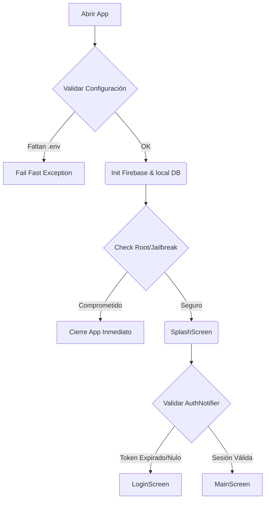
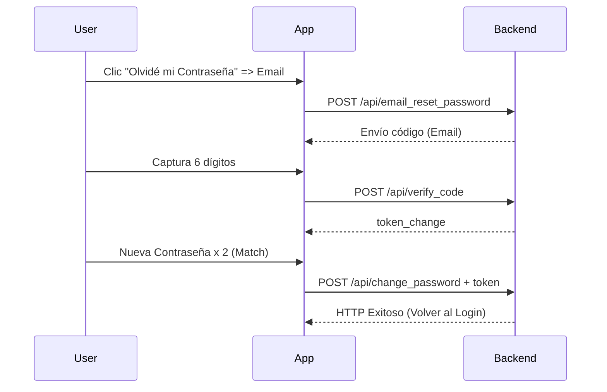
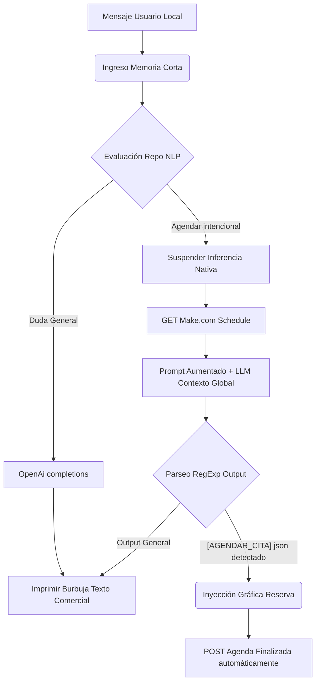

# 03 - Flujos principales

## 1. Objetivo

Documentar los flujos operativos de mayor impacto para usuario y negocio, de forma end-to-end.

Cada flujo incluye:

- Actor
- Precondiciones
- Secuencia
- Decisiones/ramas
- Errores frecuentes
- Resultado esperado

## 2. Flujo F01 - Arranque y Control de Sesión

### 2.1 Actor
- Usuario final

### 2.2 Precondiciones
- App instalada.
- Variables de entorno críticas configuradas (`.env`).
- Conectividad a Internet (ideal).

### 2.3 Secuencia Principal

### 2.4 Ramas de Excepción
> [!CAUTION]
> **Seguridad Estricta en Release:** Si la app detecta un dispositivo modificado (root/jailbreak) o faltan variables críticas, el sistema se autodestruye/falla de inmediato para proteger los endpoints.

### 2.5 Resultado Esperado
> [!IMPORTANT]
> El usuario aterriza en *Login* o *Home* en un máximo de 2-3 segundos dependiendo de la validez de su sesión.

## 3. Flujo F02 - Inicio de Sesión

### 3.1 Actor
- Usuario final

### 3.2 Precondiciones
- El usuario cuenta con un email y contraseña registrados.

### 3.3 Secuencia Principal (Happy Path)

| Paso | Acción del Usuario | Reacción del Sistema |
|:---:|---|---|
| 1 | Captura email y contraseña en `LoginScreen`. | Valida formato (Regex de email, contraseña no vacía). |
| 2 | Presiona "Iniciar Sesión". | Muestra indicador de carga (`loading state`). |
| 3 | Espera respuesta. | `AuthRemoteDataSource.login` dispara `POST /api/login`. |
| 4 | - | Si es 200 OK: Persiste Token en `SecureStorage` y guarda TTL. |
| 5 | - | Cambia estado a `authenticated` y lanza `MainScreen`. |

### 3.4 Ramas de Error

> [!WARNING]
> - **401 Unauthorized:** Muestra *Snackbar* controlada por el UI que indica "Credenciales inválidas".
> - **Timeout / Error de Red:** Muestra advertencia de conectividad sin cerrar la app.
> - **429 Too Many Requests:** Bloqueo temporal por intentos fallidos.

### 3.5 Resultado Esperado
Una sesión activa persistida de manera segura basada en TTL y el acceso inmediato al _dashboard_ principal (`MainScreen`).

## 4. Flujo F03 - Registro de Usuario

### 4.1 Actor
- Usuario nuevo (Prospecto)

### 4.2 Secuencia Principal

| Paso | Acción del Usuario | Reacción del Sistema |
|:---:|---|---|
| 1 | Selecciona "Crear cuenta". | Despliega formulario `RegisterScreen`. |
| 2 | Rellena nombre, email, password, y número móvil (opcional). | UI Valida reglas estrictas de strings. |
| 3 | Envía solicitud. | `AuthNotifier.register(...)` llama repo remoto devolviendo estado de _Loading_. |
| 4 | - | Backend persiste datos en PostgreSQL y devuelve HTTP 201 Created. |
| 5 | - | App redirige a ventana de éxito. |

> [!NOTE]
> **Nota de Seguridad de Estado:** Este registro **no** fuerza la permanencia automática activa de sesión. El _Flow_ devuelve a estado _Unauthenticated_ requiriendo validación por Login normal como medida de saneamiento de tokens.

---

## 5. Flujo F04 - Recuperación de Contraseña

### 5.1 Actor
- Usuario sin acceso a su password.

### 5.2 Secuencia Principal

### 5.3 Errores Comunes de Operación
> [!CAUTION]
> 1. Código 6 dígitos expirado (Superado límite HTTP de backend).
> 2. Petición cortada por Timeout causando pérdida de rastreo temporal del `token_change`.
> 3. Discrepancia binaria entre las "Nuevas Contraseñas" ingresadas localmente.

---

## 6. Flujo F05 - Navegación Principal y Enrutamiento (Main Frame)

### 6.1 Actor
- Usuario autenticado

### 6.2 Jerarquía de Renderizado

1. `MainScreen` se posiciona como el _Scaffold_ raíz inyectando el _BottomNavBar_.
2. Los fragmentos se preservan a través de la API local indexada:
   - **Índice 0:** Inicio (Landing)
   - **Índice 1:** Tienda (Products)
   - **Índice 2:** Soporte (Tickets)
   - **Índice 3:** Preferencias (Perfil)
3. **El Cajón de Herramientas (Drawer):** Al deslizar hacia la derecha, el árbol del _Router_ bifurca la UI para inyectar apartados extra sin contaminar los apartados de navegación inferior: WebView de Servicios, Chatbot IA, Maps, Centro Académico.

---

## 7. Flujo F06 - Consulta Motorizada de Home (Content)

### 7.1 Actor
- Usuario autenticado (Lectura)

### 7.2 Secuencia Automática _Headless_

| Paso | Evento | Comportamiento Interno |
|:---:|---|---|
| 1 | Arranque `HomeTab` | Solicita `home_data_provider`. |
| 2 | Fetch a Candidates | `homeRemoteContentProvider` ejecuta endpoints `/home` o `/api/home`. |
| 3 | Serialización JSON | Mapea estructuras jerárquicas gigantes (`carousel`, `featured_products`, `metrics`). |
| 4 | - | UI Renderiza dinámicamente Carruseles Interactivos y ListCards. |

### 7.3 Degradación Controlada (Fallback)
> [!IMPORTANT]
> Si el bloque _Fetch a Candidates_ resulta en un estado (HTTP 404, 502, ParseException), el repositorio automáticamente consume de un archivo sembrado de `LocalDataSource` para evitar que la app quede en blanco, prestando funcionalidad informativa aunque sin dinamismo online.

---

## 8. Flujo F07 - Creación de Ticket de Soporte B2B

### 8.1 Actor
- Usuario Corporativo / Cliente

### 8.2 Secuencia de Levantamiento

1. En el tab Tickets presiona el botón interactivo de **Añadir**.
2. Completa Meta-datos: Categoría (Incidencia, Mejora), Asunto, Body descriptivo.
3. `CreateTicketNotifier.createTicket()` se adhiere al Provider de UI.
4. El Repo inyecta `POST /tickets`.
5. Si exito (200 OK): **Trazabilidad cruzada**: La app lee el cuerpo de descripción de la UI y lanza un mensaje adicional simulado para establecer el "Hito cero" del Hilo del chat del Ticket.
6. La cascada en el UI reactiva los Providers para listar los tickets Actualizadas en tiempo real.

---

## 9. Flujo F08 - Conversación Unidireccional y Carga Híbrida

### 9.1 Actor
- Usuario o Agente de Operaciones Original Lab

### 9.2 Secuencia Interactiva de Chat Room
1. Apertura de `TicketDetailScreen`.
2. Hilo se recarga cíclicamente a un ratio de `5 Segundos` (Polling en memoria).
3. **Ruta Subida de Medios:**
   - Selección de Fotografía desde Galería Nativa del Móvil.
   - Restricción DURA en Dart de *Max Size: 5MB*.
   - POST multiparámetro a `/upload`. Retorna CDN URL o Hash ID.
4. Anclaje de Texto + URL de medios se empuja como `message` convencional al microservicio `tickets/{id}/messages`.
5. Refresco Polling inyecta datos nuevos a las burbujas de diálogo animadas.

> [!WARNING]
> Si el agente cerró el ticket (Estado `Closed`), cualquier campo de Input en la UI desaparece garantizando inmutabilidad contractual de la resolución y de la base de datos backend.

---

## 10. Flujo F09 - Agendamiento Bidireccional de Reservas

### 10.1 Actor
- Usuario Autenticado buscando Asesoría

### 10.2 Secuencia Multicapa (Cross-Boundary)

| Fase | Acción / Desencadenante | Resolución Transaccional |
|---|---|---|
| **Intención** | Selecciona `ServiceSelectionScreen` (O tipeo libre) | Parametrización del interés comercial. |
| **Bypass Servidor**| Abre tab de Reservas (`AvailabilityScreen`) | `GET` webhook a Make.com cruzando calendario Google de The Original Lab. |
| **Time-Mapping** | Renderizado Matricial Interno | Cruza de huecos preexistentes locales contra eventos marcados para limpiar horarios ocupados (08:00 - 18:00 hrs). |
| **Commitment** | Ingresa contacto en `ConfirmationScreen` | Dispara POST de aserción al webhook (`SCHEDULE`). |
| **Cierre** | Confirmación UI | El usuario recibe Snackbar indicando inyección de base. |

---

## 11. Flujo F10 - Visibilidad de "Mis Citas"

### 11.1 Propósito Estructural
Toda cita enviada y aceptada se inyecta nuevamente en consumo a través del micro-proveedor `MyAppointmentsScreen`. Convierte los _Timestamps_ JSON y clasifica dinámicamente en arrays paralelos locales entre "Activos/Futuros" y "Culminados". 

---

## 12. Flujo F11 - Inserción Híbrida del Asesor Inteligente (Chatbot AI)

### 12.1 Flujo Operativo Autónomo

> [!NOTE]
> La sofisticación real del Flujo 11 radica en cómo una cadena natural del usuario se manipula arquitectónicamente para robar el control visual (renderizar tarjetas gráficas de confirmación basadas en JSON emitido por IA) logrando convergencia UI/AI.

---

## 13. Flujo F12 - Receptor de Telecomunicaciones (FCM Push)

### 13.1 Patrones de Despertar

- **Foreground (Activa):** App recibe Payload FCM silencioso y dispara biblioteca auxiliar `LocalNotifications` inflando el *Snackbar Banner Heads-Up*.
- **Background (En segundo plano - Doze Mode):** Sistema Operativo ataja capa de Firebase y muestra notificación de barra estándar de Android/iOS.
- **Data Persistence:** Sea cual sea la vía de despertar, el paquete de red entra al Provider `notificationsProvider` alimentando el Array local que cuenta con limitador numérico para cuidar la RAM. Notifica en vivo al Badge Icon del AppBar Global.

---

## 14. Flujo F13 - Mapa y Direccionamiento

### 14.1 Secuencia Interactiva
1. Apertura de `MapScreen` y visualización del marcador de sucursal.
2. Acción sobre botón flotante "Cómo llegar".
3. **Intent Externo:** La app inyecta coordenadas GPS absolutas a través del canal de SO nativo (URL Launcher hacia `google.navigation:q=lat,lng`).

---

## 15. Flujo F14 - Desconexión Segura (Log-Out)

### 15.1 Vías de Desencadenamiento
- **Manual Controlado:** Botón en capa de Perfil de usuario.
- **Detección Falsa (401):** Interceptor de Dio apaga la sesión ante denegación de red.
- **Inactividad Física:** Agotados los 15 minutos en TimerUI.

### 15.2 Procedimiento de Cierre
1. Invalidación de metadatos en backend _(Si aplica)_.
2. Limpieza destructiva total contra `flutter_secure_storage`.
3. Flush en la memoria RAM hacia Providers: transición del estado central a `Unauthenticated`.
4. El Router rechaza el acceso bloqueador empujando a `LoginScreen`.

---

## 16. Matriz de Dependencias Operativas

| Flujo | Dependencias Críticas |
|---|---|
| F01-F04 (Auth) | API Auth, Cloud DB |
| F06 (Home) | API Content + Caché Local Fuerte |
| F07-F08 (Tickets) | API Tickets + Módulo de Cargas Multipart (`/upload`) |
| F09-F10 (Meetings) | **Webhooks Make.com** |
| F11 (Chatbot) | **OpenAI Platform** + **Webhooks Make.com** |
| F12 (Notificaciones) | **Firebase Cloud Messaging** |

---

## 17. Checklist Rápido QA Funcional (UAT)

Para atestiguar que el build está en forma antes de subir a PlayStore:
- [ ] Validar Login y forzar expiración no interactiva de 15 min.
- [ ] Subir Ticket, subir fotografía pesada (>2MB), forzar status `closed` desde postman para presenciar UI Locking.
- [ ] Agendar cita libre desde tab Reservas y cotejar presencia en el _WebView_ Make.com o calendario.
- [ ] Engañar Chatbot IA con intenciones difusas y comprobar si extrae correctamente los triggers JSON.
- [ ] Suspender la conexión simulada (HTTP 500) del backend Content y constatar que Home renderiza la versión base local amigablemente.
